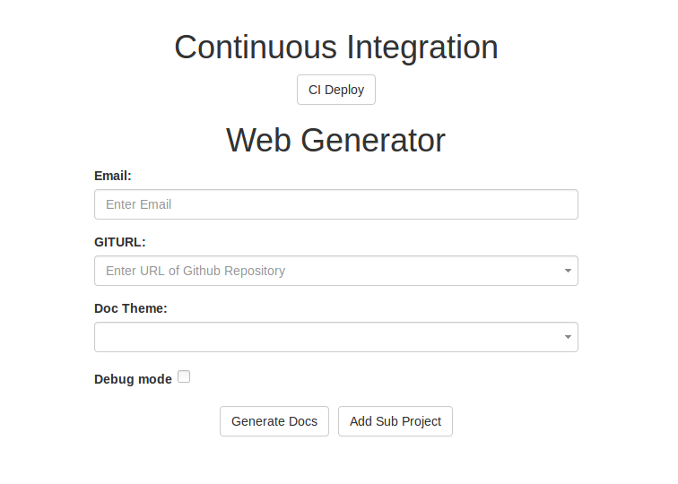
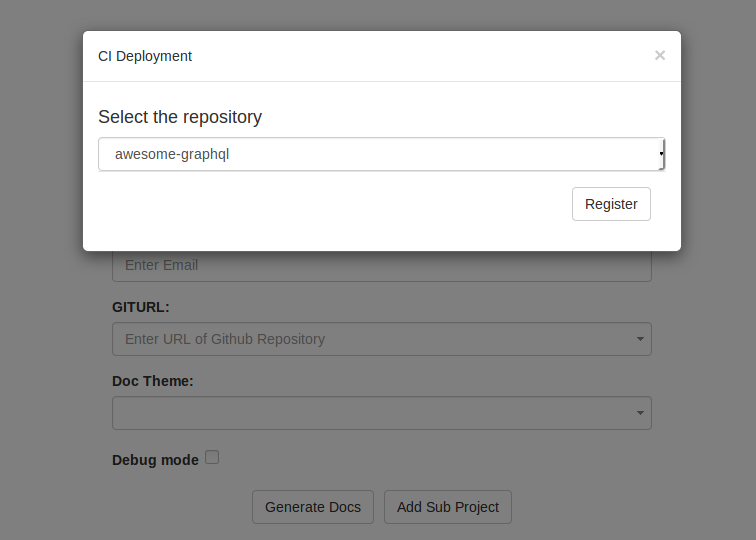
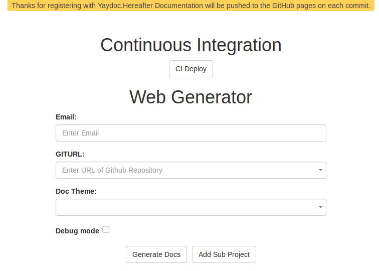

# Yaydoc
[](https://travis-ci.org/fossasia/yaydoc)
[](https://gitter.im/fossasia/yaydoc?utm_source=badge&utm_medium=badge&utm_campaign=pr-badge&utm_content=badge)

> Docs! Yay!

## Deployment
[](https://heroku.com/deploy)

## Prerequisites
- Create a directory in your repository containing all the markup files along with an `index.rst` file which contains [toctrees](http://www.sphinx-doc.org/en/stable/markup/toctree.html) to link the various documents. You can also provide the index in markdown format although then you won't be able to include other documents such as the `README` into them.
- Register your repository with [Yaydoc CI](https://yaydoc.herokuapp.com).
- If you use embedded html in markdown or ReST, any static content such as images, javascript referred from it should be present in a `_static` directory placed under **source**.

## Usage

Yaydoc will automatically read configuration from a file named *.yaydoc.yml* stored at the root of your repository.

- Specifying Metadata

```yaml
metadata:
  author: FOSSASIA       # Author of the project, default: Github uername or organization
  projectname: Yaydoc    # Name of the Project, default: Name of the repository
  version: development   # Version of the Project, default: UTC date of latest deployment
  debug: true            # Enables detailed logging, default: false
```

- Configuring build options

```yaml
build:
  theme:
    name: sphinx_fossasia_theme        # Name of the theme. Apart from built in sphinx themes, custom themes from PyPI are also supported, default: sphinx_fossasia_theme
    options:                           # The respective theme options. They are theme specific.
      link_about: '/about'
      show_fossasia_logo: true
  source: docs                         # Path of the documentation, default: docs
  logo: images/logo.svg                # Path to an image to be used as logo for the Project. It should be relative to `source`.
  markdown_flavour: markdown_github    # Markdown format flavour. should be one of `markdown`, `markdown_strict`, `markdown_phpextra`, `markdown_github`, `markdown_mmd`, `commonmark`, default: markdown_github
  mock:                                # Any python modules or packages which should be mocked. Useful if your project depends on C dependencies.
    - numpy
    - scipy
  autoapi:               # If enabled, Yaydoc will crawl your repository and try to extract API documentation
    - language: python   # Language for which API docs should be generated.
      source: modules    # If specified, only the `source` would be crawled to extract APIs
    - language: java
  subproject:            # Other projects which should be included when building the documentation
    - url: <URL of Subproject 1>       # URL of the repository
      source: doc                      # Path of the documentation of the subproject, default: docs
    - url: <URL of subproject 2>
  github_ribbon:         # Display a `Fork me on Github` ribbon
    position: right      # Position of the ribbon, Allowed values: left | right, default: right
    color: green         # Color of the ribbon, Allowed values: red | green | darkblue | orange | gray | white, default: red
  github_button:         # Display various Github buttons.
    buttons:
      watch: true        # Display watch button, default: true
      star: true         # Display star button, default: true
      issues: true       # Display issues button, default: true
      fork: true         # Display fork button, default: true
      follow: true       # Display follow button, default: true
    show_count: true     # Display count beside buttons
    large: true          # Use large buttons
```

- Configuring publishers

```yaml
publish:
  ghpages:
    url: yaydoc.fossasia.org       # Custom URL at which the site should be published, default: <username>.github.io/<reponame>
  heroku:
    app_name: yaydoc               # Name of the heroku app. Your docs would be deployed at <app_name>.herokuapp.com
```

- Configuring External services

```yaml
extras:
  swagger:                              # Supported api-docs [ swagger(https://swagger.io/) ]
    url: http://api.susi.ai/docs/swagger.json   # URL to the JSON specification
    ui: swagger                                 # Supported UI [ swagger(https://swagger.io/swagger-ui/) ], default: swagger
  javadoc:
    path: 'src/'                                # Path for javadoc source files
```
Currently Yaydoc only supports publishing to ghpages and heroku.

## Accessing the Yaydoc CI


 - Click the `CI Deploy` button



 - Select the repository in which you want to integrate Yaydoc CI



- After successful registration Yaydoc will push the documentation to gh-pages on every commit the user makes.

- Sphinx's alabaster theme will be used for documentation

- You can see the generated documentation at `https://<username>.github.io/<project name>`

## Custom directives
- RSS feed
```
.. feed:: <rss url>
```
- Twitter Feed
```
.. timeline:: <query>
```
