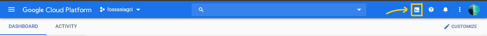
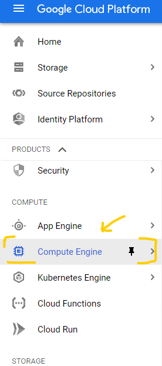
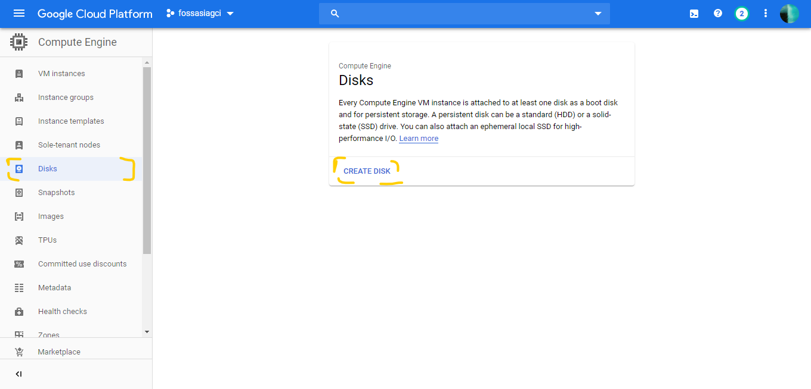
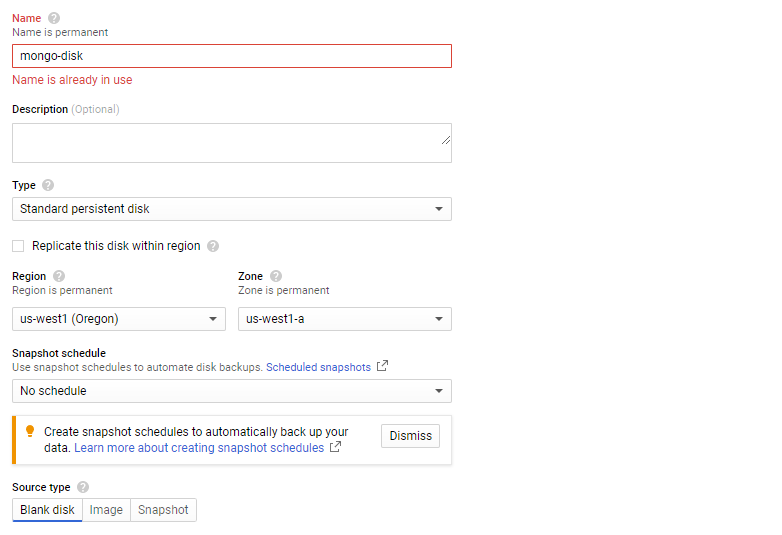
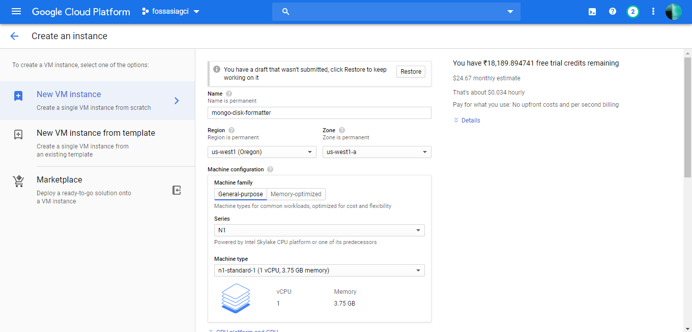
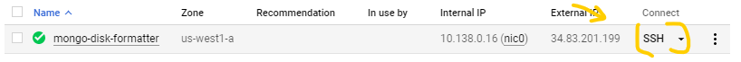

# Yaydoc Deployment to Google Cloud with Kubernetes

## Setup

- If you don’t already have a Google Account (Gmail or Google Apps), you must [create one](https://accounts.google.com/SignUp). Then, sign-in to Google Cloud Platform console ([console.cloud.google.com](http://console.cloud.google.com/)) and create a new project:

- Store your project ID into a variable as many commands below use it:

    ```
    export PROJECT_ID="your-project-id"
    ```
> **Note**: Some of the Cloud setup process can be done using Google Cloud Console. Follow along the documentation of each step to find how to do it.
>
- Next, [enable billing](https://console.cloud.google.com/billing) in the Cloud Console in order to use Google Cloud resources and [enable the Container Engine API](https://console.cloud.google.com/project/_/kubernetes/list).

- Install [Docker](https://docs.docker.com/install/), and [Google Cloud SDK](https://cloud.google.com/sdk/).

- Finally, after Google Cloud SDK installs, run the following command to install `kubectl`:

    ```
    gcloud components install kubectl
    ```

- Choose a [Google Cloud Project zone](https://cloud.google.com/compute/docs/regions-zones/regions-zones) to run your service. We will be using us-west1-a. This is configured on the command line via:

    ```
    gcloud config set compute/zone us-west1-a
    ```
- For Proceeding with Cloud Console 
  - Go to https://console.cloud.google.com/home and select the project you are working on
  - click on this button
    
  - Run this command 
    ```
    gcloud config set compute/zone us-west1-a
    ```


## Create and format a persistent data disk for MongoDB

- Create a persistent disk (min. 1 GB) with a name `mongo-disk`.
    - In Desktop Terminal or cloud console:
        ```
        gcloud compute disks create mongo-disk --size 1GB
        ```
    - In Google Cloud:
      - Click on Compute Engine 
      - Go to disc and create a new Disk
        
        
        >Be sure to put region **us-west1** and zone **a** and size of minimum **2GB**

- The disk created is unformatted and needs to be formatted. To do that, we need to create a temporarily compute instance.
    - In terminal or console:
        ```
        gcloud compute instances create mongo-disk-formatter
        ```
    - Using Graphical Google cloud dashboard
      - Go to "VM instances" in **Compute Engine**
      - Click on **create** button and create a new instance of name "**mongo-disk-formatter** with region **us-west1** and zone **a**
        

- Wait for the instance to get created. Once done, attach the disk to that instance in either the cloud console or your desktop terminal.

    ```
    gcloud compute instances attach-disk mongo-disk-formatter --disk mongo-disk
    ```

- SSH into the instance 
    - using console/terminal.
        ```
        gcloud compute ssh "mongo-disk-formatter"
        ```
    - using graphical interface 
      - Click on the ssh button under **Connect**
        
- In the terminal, use the `ls` command to list the disks that are attached to your instance and find the disk that you want to format and mount

    ```
    ls /dev/disk/by-id
    ```

    ```
    google-example-instance       scsi-0Google_PersistentDisk_example-instance
    google-example-instance-part1 scsi-0Google_PersistentDisk_example-instance-part1
    google-[DISK_NAME]            scsi-0Google_PersistentDisk_[DISK_NAME]
    ```

    where `[DISK_NAME]` is the name of the persistent disk that you attached to the instance.

    The disk ID usually includes the name of your persistent disk with a `google-` prefix or a `scsi-0Google_PersistentDisk_` prefix. You can use either ID to specify your disk, but this example uses the ID with the `google-` prefix


- Format the disk with a single `ext4` filesystem using the `mkfs` tool. This command deletes all data from the specified disk.

    ```
    sudo mkfs.ext4 -F -E lazy_itable_init=0,lazy_journal_init=0,discard /dev/disk/by-id/google-[DISK_NAME]
    ```

- The disk is now formatted and ready to use.
- Now exit the SSH session and detach the disk from the instance by running

    ```
    gcloud compute instances detach-disk mongo-disk-formatter --disk mongo-disk
    ```

_You can delete the instance if your not planning to use it for anything else. But make sure the disk `mongo-disk` is not deleted._

> **Note: From now on you need to be on the local system in order to deploy**
## Create your Kubernetes Cluster

- Create a cluster via the `gcloud` command line tool *(assuming your project is on the **us-west1-a** zone)*:

    ```
    gcloud container clusters create yaydoc-cluster --zone us-west1-a --project [Your Project Name]
    ```

- Get the credentials for `kubectl` to use.

    ```
    gcloud container clusters get-credentials yaydoc-cluster --zone us-west1-a --project [Your Project Name]
    ```

## Pre deployment steps
- A domain name (Eg. yaydoc.org, google.com, hello.io). - A free domain can be registered at http://www.freenom.com .
- Reserve a static external IP address

	```bash
	gcloud compute addresses create testip --region us-west1
	```

	The response would be similar to
- Get the addresss
    ```
    gcloud compute addresses list
    ```

    The Result will be similar to 

    |NAME         |ADDRESS/RANGE|TYPE         |PURPOSE      |NETWORK      |REGION       |SUBNET       |STATUS       |
    |-------------|-------------|-------------|-------------|-------------|-------------|-------------|-------------|
    |testip       |123.123.13.12|EXTERNAL     |             |             |us-west1     |             |RESERVED     |

	Note down the address. (In this case `123.123.13.12`). We'll call this **External IP Address One**.
- Add the **External IP Address One** as an `A` record to your domain's DNS Zone.
- Add the **External IP Address One** to `kubernetes/yamls/nginx/service.yml` for the parameter `loadBalancerIP`.
- Add your domain name to `kubernetes/yamls/web/ingress-notls.yml` & `kubernetes/yamls/web/ingress-tls.yml`. (replace `yaydoc.org`)
- In `kubernetes/yamls/mongo/mongo-deployment.yml` ensure `pdName` is `mongo-disk`. Else change it.

## Deploy our pods, services and deployments

- Update the `kubernetes/yamls/yaydoc/configmap.yml` file with relevant values for the defined environment variables.
- From the project directory, use the provided deploy script to deploy our application from the defined configuration files that are in the `kubernetes` directory.

    ```
    ./kubernetes/deploy.sh create all
    ```

- The Kubernetes master creates the load balancer and related Compute Engine forwarding rules, target pools, and firewall rules to make the service fully accessible from outside of Google Cloud Platform.
- Wait for a few minutes for all the containers to be created and the SSL Certificates to be generated and loaded.
- You can track the progress using the Web GUI as mentioned below.
- Once deployed, your instance will be accessible at your domain name.


## Other handy commands

- Delete all created pods, services and deployments

    ```
    ./kubernetes/deploy.sh delete all
    ```

-  Access The Kubernetes dashboard Web GUI

    Run the following command to start a proxy.

    ```
    kubectl proxy
    ```

    and go to [http://localhost:8001/ui](http://localhost:8001/ui)

- Deleting the cluster
    ```
    gcloud container clusters delete yaydoc-cluster
    ```
- Deleting reserved IP
    
    Run the following command to delete the reserved IP
    ```
    gcloud compute addresses delete testip --region us-west1
    ```